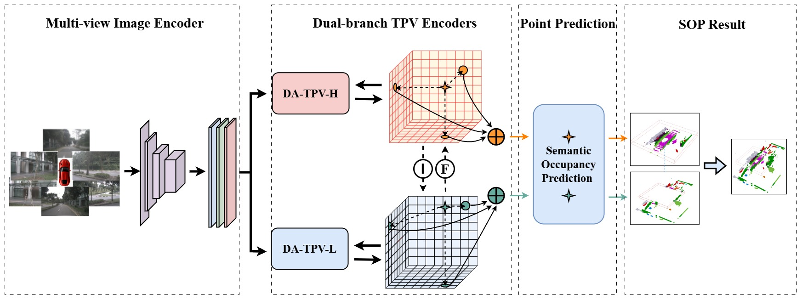
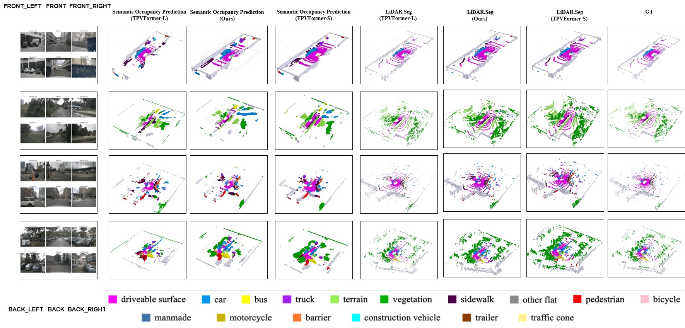
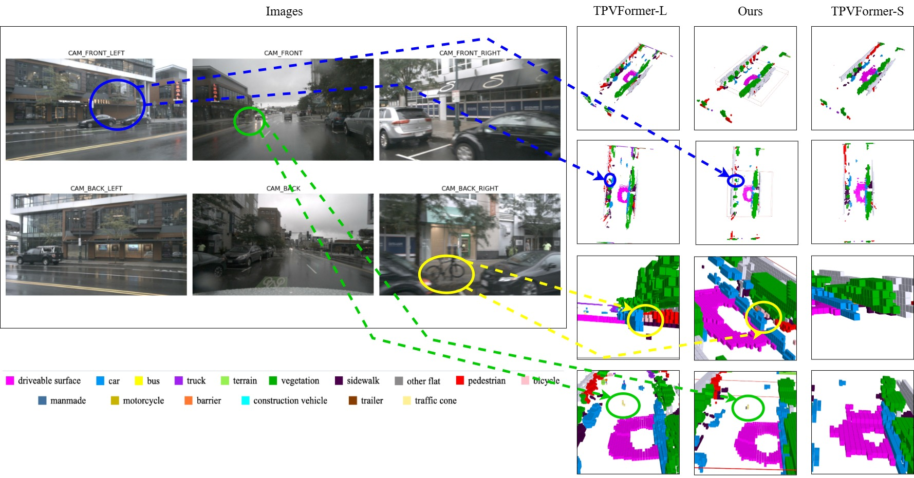

   
  
# Distance-Aware Tri-Perspective View for Efficient 3D Perception in Autonomous Driving

<!--
### [Paper](https://arxiv.org/pdf/2302.07817) | [Project Page](https://wzzheng.net/TPVFormer/) | [Leaderboard](https://www.nuscenes.org/lidar-segmentation?externalData=all&mapData=all&modalities=Camera)
-->

> Yutao Tang*, Jigang Zhao\* , Zhengrui Qin, Lingying Zhao, Guangxi Chen$\ddagger$,Jie Ren$\ddagger$

\* Equal contribution  $\ddagger$ Corresponding author

# Abstract
Three-dimensional environmental perception remains a critical bottleneck in autonomous driving, where existing vision-based dense representations face an intractable trade-off between spatial resolution and computational complexity. Current methods, including Bird's Eye View (BEV) and Tri-Perspective View (TPV), apply uniform perception precision across all spatial regions, disregarding the fundamental safety principle that near-field objects demand high-precision detection for collision avoidance while distant objects permit lower initial accuracy. This uniform treatment squanders computational resources and constrains real-time deployment. We introduce Distance-Aware Tri-Perspective View (DA-TPV), a novel framework that allocates computational resources proportional to operational risk. DA-TPV employs a hierarchical dual-plane architecture for each viewing direction: low-resolution planes capture global scene context while high-resolution planes deliver fine-grained perception within safety-critical reaction zones. Through distance-adaptive feature fusion, our method dynamically concentrates processing power where it most directly impacts vehicle safety. Extensive experiments on nuScenes demonstrate that DA-TPV matches or exceeds single high-resolution TPV performance while reducing memory consumption by 26.3\% and achieving real-time inference. This work establishes distance-aware perception as a practical paradigm for deploying sophisticated three-dimensional understanding within automotive computational constraints. 

# Methods

<!-- # Getting Started
- [Installation](docs/install.md) 
- [Prepare Dataset](docs/prepare_dataset.md)
- [Run and Eval](docs/getting_started.md) -->

# Model Zoo
Baidu Netdisk Extraction code: **2222**
## LiDAR Segmentation
| Method | mIoU  | model| config |
| :-- | :--: |  :-- |  :-- |
| datpv | 55.2 | [model](https://pan.baidu.com/s/10Fpbfhqdj_0ra_QMTeHYAA)/[log](https://pan.baidu.com/s/1GfJXNk7HJ5yXLBBGGlcJXg) | [config](configs/datpv_lidar.txt) |

## 3D Semantic Occupancy Prediction
| Method | model | config |
| :-- | :--: |  :-- |
| datpv | [model]| [config](configs/datpv_sop.txt) |
### Visualization

## Semantic Scene Completion
| Method | SC IoU | SSC mIoU  | model | config |
| :-- | :--: |  :-- |  :-- |  :-- |
| datpv | 43.33 | 10.69 | [model]| [config](configs/datpv_ssc.txt) |

<!-- | tpv-l | 53.9 | [model]| [log] | [config] |
| tpv-s | 47.3 | [model]| [log] | [config] | -->

<!-- | tpv-l | [model]| [config] |
| tpv-s | [model]| [config] | -->

<!-- | tpv-l | 43.38 | 10.69 | [model]| [config] |
| tpv-s | 41.24 | 10.69 | [model]| [config] | -->

# Acknowledgement

Many thanks to these excellent open source projects:
- [tpvformer](https://github.com/wzzheng/TPVFormer) 
- [mmdet3d](https://github.com/open-mmlab/mmdetection3d)
